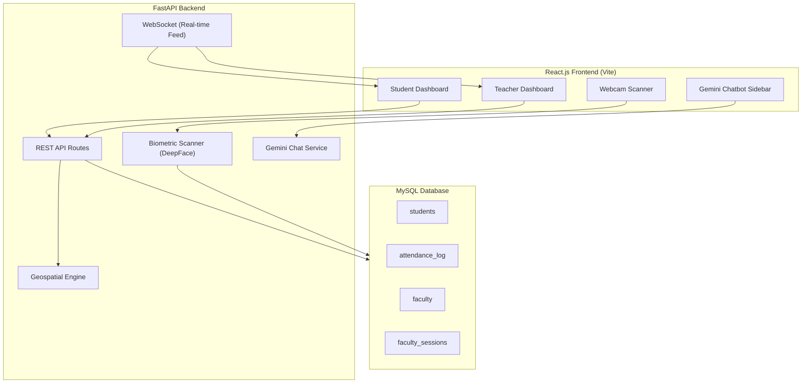
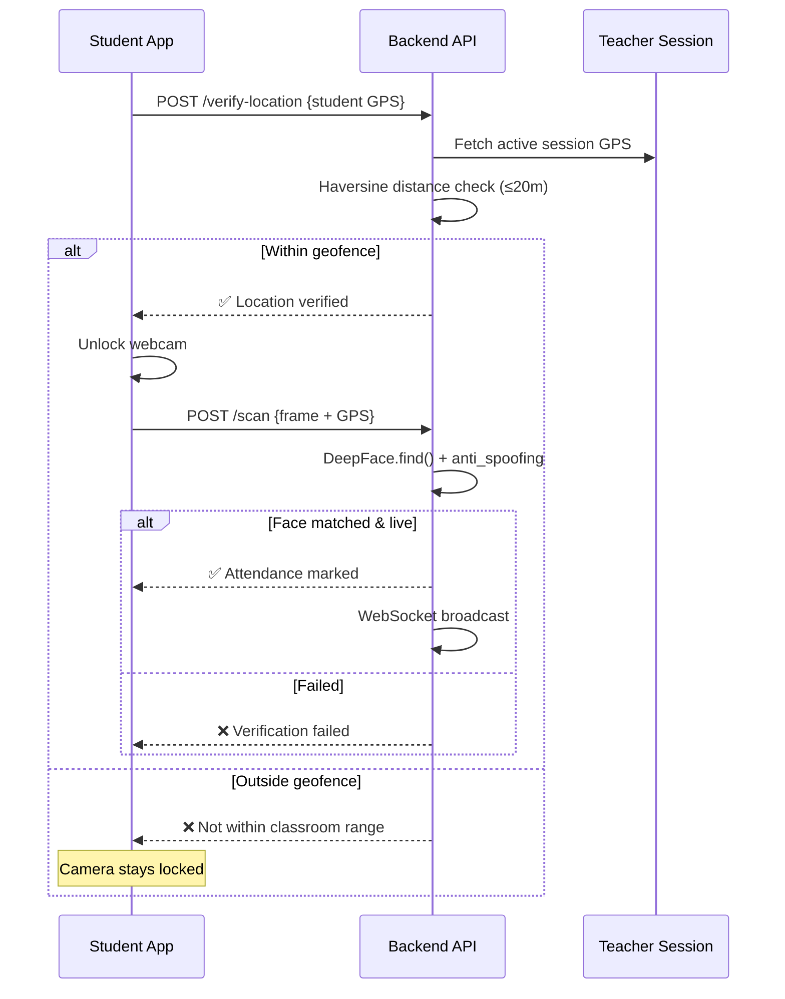

# VIGIL-AI — High-Security Student Attendance System

A full-stack biometric attendance system with GPS geofencing, face recognition with liveness detection, AI chatbot, and dynamic dashboards.

## Architecture Overview



---

## Tech Stack

| Layer | Technology |
|-------|-----------|
| Frontend | React.js 18 (Vite), React Router, Chart.js, react-chartjs-2, react-webcam |
| Backend | FastAPI, SQLAlchemy 2.0 (async), Uvicorn, python-jose (JWT) |
| Database | MySQL 8+ with `aiomysql` async driver |
| Face Recognition | DeepFace (with `anti_spoofing=True`), OpenCV |
| AI Chatbot | Google Gemini API (`@google/generative-ai` on frontend, `google-generativeai` on backend) |
| Real-time | WebSockets (FastAPI native) |

---

## User Review Required

> [!IMPORTANT]
> **API Keys Required**: The system needs a **Google Gemini API key** for the chatbot. You'll need to provide this before running the system.

> [!IMPORTANT]
> **MySQL Setup**: You need a running MySQL 8+ instance. The plan assumes `localhost:3306` with credentials you provide. The app will auto-create tables on startup.

> [!WARNING]
> **Student Face Database**: A `student_db/` folder must be populated with student face images (one subfolder per student, named by student ID) for face recognition to work. I'll create the folder structure and a sample setup script.

> [!IMPORTANT]
> **DeepFace Dependencies**: DeepFace requires `tensorflow` or `tf-keras` which are large packages (~500MB+). The first face recognition call will also download model weights. This is expected behavior.

---

## Open Questions

> [!IMPORTANT]
> 1. **MySQL Credentials**: What are your MySQL host, port, username, password, and database name? I'll default to `localhost:3306`, user `root`, password `root`, database `vigil_ai` — is this acceptable?

> [!IMPORTANT]
> 2. **Gemini API Key**: Do you have a Gemini API key ready? The chatbot feature requires it. I can make it configurable via `.env` file.

> [!NOTE]
> 3. **Student Photos**: Do you have existing student photos, or should I create a demo mode with sample data for testing?

---

## Proposed Changes

### Database Schema

#### [NEW] `backend/database/schema.sql`

```sql
-- Students table (Bio-data)
CREATE TABLE students (
    id INT AUTO_INCREMENT PRIMARY KEY,
    student_id VARCHAR(20) UNIQUE NOT NULL,
    first_name VARCHAR(100) NOT NULL,
    last_name VARCHAR(100) NOT NULL,
    email VARCHAR(150) UNIQUE NOT NULL,
    phone VARCHAR(15),
    department VARCHAR(100),
    semester INT,
    face_image_path VARCHAR(500),
    created_at TIMESTAMP DEFAULT CURRENT_TIMESTAMP,
    updated_at TIMESTAMP DEFAULT CURRENT_TIMESTAMP ON UPDATE CURRENT_TIMESTAMP
);

-- Faculty table
CREATE TABLE faculty (
    id INT AUTO_INCREMENT PRIMARY KEY,
    faculty_id VARCHAR(20) UNIQUE NOT NULL,
    first_name VARCHAR(100) NOT NULL,
    last_name VARCHAR(100) NOT NULL,
    email VARCHAR(150) UNIQUE NOT NULL,
    department VARCHAR(100),
    password_hash VARCHAR(255) NOT NULL,
    created_at TIMESTAMP DEFAULT CURRENT_TIMESTAMP
);

-- Faculty Sessions (active classroom with GPS)
CREATE TABLE faculty_sessions (
    id INT AUTO_INCREMENT PRIMARY KEY,
    faculty_id INT NOT NULL,
    subject_name VARCHAR(200) NOT NULL,
    latitude DECIMAL(10, 8) NOT NULL,
    longitude DECIMAL(11, 8) NOT NULL,
    geofence_radius_meters INT DEFAULT 20,
    session_start TIMESTAMP DEFAULT CURRENT_TIMESTAMP,
    session_end TIMESTAMP NULL,
    is_active BOOLEAN DEFAULT TRUE,
    FOREIGN KEY (faculty_id) REFERENCES faculty(id)
);

-- Attendance Log
CREATE TABLE attendance_log (
    id INT AUTO_INCREMENT PRIMARY KEY,
    student_id INT NOT NULL,
    session_id INT NOT NULL,
    latitude DECIMAL(10, 8),
    longitude DECIMAL(11, 8),
    confidence FLOAT,
    is_live BOOLEAN DEFAULT TRUE,
    marked_by ENUM('biometric', 'manual') DEFAULT 'biometric',
    marked_by_faculty_id INT NULL,
    timestamp TIMESTAMP DEFAULT CURRENT_TIMESTAMP,
    FOREIGN KEY (student_id) REFERENCES students(id),
    FOREIGN KEY (session_id) REFERENCES faculty_sessions(id),
    FOREIGN KEY (marked_by_faculty_id) REFERENCES faculty(id),
    UNIQUE KEY unique_attendance (student_id, session_id)
);
```

---

### Backend (FastAPI)

#### [NEW] `backend/requirements.txt`
Dependencies: `fastapi`, `uvicorn[standard]`, `sqlalchemy[asyncio]`, `aiomysql`, `deepface`, `opencv-python-headless`, `python-jose[cryptography]`, `passlib[bcrypt]`, `python-multipart`, `google-generativeai`, `python-dotenv`, `numpy`, `Pillow`

#### [NEW] `backend/.env`
Environment config: MySQL URL, Gemini API key, JWT secret

#### [NEW] `backend/main.py`
FastAPI app entry point with CORS, lifespan events, router mounting, and WebSocket manager.

#### [NEW] `backend/database/connection.py`
Async SQLAlchemy engine + session factory using `create_async_engine` with `mysql+aiomysql`. Dependency injection via `get_db()`.

#### [NEW] `backend/database/models.py`
SQLAlchemy ORM models for `Student`, `Faculty`, `FacultySession`, `AttendanceLog` using `Mapped` and `mapped_column` (SQLAlchemy 2.0 style).

#### [NEW] `backend/core/config.py`
Pydantic `BaseSettings` for loading env vars.

#### [NEW] `backend/core/security.py`
JWT token creation/verification, password hashing with bcrypt.

#### [NEW] `backend/services/geofence.py`
**The Geospatial Engine** — Haversine formula implementation with detailed comments explaining the math. Functions:
- `haversine_distance(lat1, lon1, lat2, lon2) -> float` — Returns distance in meters
- `is_within_geofence(teacher_lat, teacher_lon, student_lat, student_lon, radius=20) -> bool`

```python
# The Haversine Formula calculates the great-circle distance between
# two points on a sphere given their longitudes and latitudes.
#
# Formula:
#   a = sin²(Δφ/2) + cos(φ1) · cos(φ2) · sin²(Δλ/2)
#   c = 2 · atan2(√a, √(1−a))
#   d = R · c
#
# Where:
#   φ = latitude in radians
#   λ = longitude in radians
#   R = Earth's radius (6,371,000 meters)
#   Δφ = difference in latitudes
#   Δλ = difference in longitudes
```

#### [NEW] `backend/services/face_recognition.py`
**The Biometric Scanner** — Uses DeepFace with OpenCV:
- `verify_face(image_base64, student_id) -> dict` — Matches webcam frame against `student_db/{student_id}/`
- Uses `DeepFace.find()` with `anti_spoofing=True` for liveness detection
- Returns: `{verified: bool, confidence: float, is_live: bool, student_id: str}`

#### [NEW] `backend/services/gemini_service.py`
**The AI Chatbot Service** — Uses `google-generativeai` Python SDK:
- System prompt with attendance context
- Can query student's attendance percentage, active sessions, teacher availability
- Answers natural language questions by querying DB

#### [NEW] `backend/routes/auth.py`
Routes: `POST /api/auth/login/student`, `POST /api/auth/login/faculty`, `POST /api/auth/register/faculty`

#### [NEW] `backend/routes/students.py`
Routes: `GET /api/students/`, `GET /api/students/{id}`, `POST /api/students/`, `GET /api/students/{id}/attendance`

#### [NEW] `backend/routes/attendance.py`
Routes:
- `POST /api/attendance/verify-location` — Check GPS geofence
- `POST /api/attendance/scan` — Submit webcam frame for face verification + mark attendance
- `POST /api/attendance/manual` — Teacher manual override
- `GET /api/attendance/session/{session_id}` — Get all attendance for a session
- `GET /api/attendance/stats/{student_id}` — Get attendance stats for dashboard

#### [NEW] `backend/routes/sessions.py`
Routes:
- `POST /api/sessions/start` — Teacher starts a class (sends GPS coords)
- `POST /api/sessions/end/{session_id}` — Teacher ends a class
- `GET /api/sessions/active` — Get all active sessions
- `GET /api/sessions/active/{faculty_id}` — Get teacher's active session

#### [NEW] `backend/routes/chat.py`
Routes: `POST /api/chat/` — Send message to Gemini with attendance context

#### [NEW] `backend/routes/dashboard.py`
Routes:
- `GET /api/dashboard/student/{student_id}` — Heatmap data, health bar, recent activity
- `GET /api/dashboard/teacher/{faculty_id}` — Class stats, student list, attendance rates

#### [NEW] `backend/websocket/manager.py`
WebSocket connection manager for real-time attendance feed (who's scanning in right now).

---

### Frontend (React.js + Vite)

#### [NEW] `frontend/` — Vite React project
Initialize with: `npx -y create-vite@latest ./ --template react`

#### [NEW] `frontend/src/App.jsx`
Root component with React Router:
- `/login` — Login page (student/teacher toggle)
- `/teacher` — Teacher Dashboard
- `/student` — Student Dashboard
- `/scan` — Attendance scanning page

#### [NEW] `frontend/src/index.css`
**Design System** — Dark theme with:
- CSS custom properties for colors (deep navy `#0a0e27`, electric blue `#00d4ff`, violet `#7c3aed`, emerald `#10b981`)
- Glassmorphism cards (`backdrop-filter: blur`)
- Smooth transitions and micro-animations
- Google Font: Inter

#### [NEW] `frontend/src/pages/LoginPage.jsx`
Premium login page with glassmorphism card, student/teacher toggle, animated background.

#### [NEW] `frontend/src/pages/TeacherDashboard.jsx`
**Teacher Portal** with:
- **Start/End Class** button (captures GPS via `navigator.geolocation`)
- **Active Session** indicator with live student count
- **Manual Override** panel — search student, mark attendance manually
- **Student List** for current session with attendance status
- **Real-time Feed** (WebSocket) showing students scanning in

#### [NEW] `frontend/src/pages/StudentDashboard.jsx`
**Student Activity Hub** with:
- **Attendance Heatmap** (calendar grid using Chart.js matrix plugin or custom CSS grid)
- **Health Bar** — 75% threshold progress bar with color coding (green/yellow/red)
- **Real-time Status Feed** — Live feed of who's scanning in
- **Quick Stats** — Total classes, attended, percentage
- **Mark Attendance** button (only active when teacher has started class + within 10 min window)

#### [NEW] `frontend/src/pages/ScanPage.jsx`
**Biometric Scanner Page**:
1. First checks GPS location against active session geofence
2. If within radius → opens webcam via `react-webcam`
3. Captures frame → sends to `/api/attendance/scan`
4. Shows liveness + verification result with confidence score
5. Animated success/failure states

#### [NEW] `frontend/src/components/ChatbotSidebar.jsx`
**Gemini AI Chatbot** — Slide-out sidebar:
- Chat bubble UI with user/AI message styling
- Pre-built quick questions: "What is my attendance?", "Is the teacher in the room?"
- Markdown rendering for AI responses
- Collapsible with floating action button

#### [NEW] `frontend/src/components/AttendanceHeatmap.jsx`
GitHub-style contribution heatmap for attendance (custom CSS grid, 7 rows × ~52 cols).

#### [NEW] `frontend/src/components/HealthBar.jsx`
Animated progress bar with 75% threshold marker. Color transitions: red (<60%) → yellow (60-75%) → green (>75%).

#### [NEW] `frontend/src/components/StatusFeed.jsx`
Real-time WebSocket feed showing students scanning in with timestamps and verification status.

#### [NEW] `frontend/src/components/Navbar.jsx`
Top navigation bar with user info, role badge, logout button.

#### [NEW] `frontend/src/components/StatsCard.jsx`
Reusable glassmorphism stat card with icon, value, label, and trend indicator.

#### [NEW] `frontend/src/context/AuthContext.jsx`
React Context for auth state management (JWT token, user role, user data).

#### [NEW] `frontend/src/services/api.js`
Axios instance with JWT interceptor, base URL config, API helper functions.

#### [NEW] `frontend/src/services/websocket.js`
WebSocket connection manager for real-time feed.

---

### Project Structure

```
VIGLI_AI/
├── backend/
│   ├── .env
│   ├── main.py
│   ├── requirements.txt
│   ├── core/
│   │   ├── config.py
│   │   └── security.py
│   ├── database/
│   │   ├── connection.py
│   │   ├── models.py
│   │   └── schema.sql
│   ├── routes/
│   │   ├── auth.py
│   │   ├── attendance.py
│   │   ├── chat.py
│   │   ├── dashboard.py
│   │   ├── sessions.py
│   │   └── students.py
│   ├── services/
│   │   ├── face_recognition.py
│   │   ├── gemini_service.py
│   │   └── geofence.py
│   ├── student_db/           # Face images per student
│   │   └── STU001/
│   │       └── face1.jpg
│   └── websocket/
│       └── manager.py
├── frontend/
│   ├── index.html
│   ├── package.json
│   ├── vite.config.js
│   └── src/
│       ├── App.jsx
│       ├── index.css
│       ├── main.jsx
│       ├── components/
│       │   ├── AttendanceHeatmap.jsx
│       │   ├── ChatbotSidebar.jsx
│       │   ├── HealthBar.jsx
│       │   ├── Navbar.jsx
│       │   ├── StatsCard.jsx
│       │   └── StatusFeed.jsx
│       ├── context/
│       │   └── AuthContext.jsx
│       ├── pages/
│       │   ├── LoginPage.jsx
│       │   ├── ScanPage.jsx
│       │   ├── StudentDashboard.jsx
│       │   └── TeacherDashboard.jsx
│       └── services/
│           ├── api.js
│           └── websocket.js
```

---

## Key Design Decisions

### 1. GPS → Camera Unlock Flow


### 2. 10-Minute Attendance Window
- When a teacher starts a class, `session_start` timestamp is recorded
- Students can only mark attendance within 10 minutes of `session_start`
- The backend validates: `current_time - session_start ≤ 10 minutes`
- Frontend shows countdown timer during the window

### 3. Liveness Detection
- DeepFace's built-in `anti_spoofing=True` flag uses MiniVision's Silent Face Anti-Spoofing models
- Detects printed photos, screen displays, and basic mask attacks via texture analysis
- Returns `is_real: bool` along with the face match result

### 4. Manual Override
- Teachers can search for students in their active session
- Mark attendance with `marked_by='manual'` and `marked_by_faculty_id` set
- This bypasses both GPS and biometric checks
- Logged separately for audit trail

---

## Verification Plan

### Automated Tests
1. **Backend startup**: `uvicorn backend.main:app --reload` — verify no import errors
2. **Database**: Auto-create tables on startup, seed demo data
3. **API testing**: Use built-in FastAPI Swagger UI at `/docs`
4. **Frontend**: `npm run dev` — verify all pages render

### Manual Verification
1. **Login Flow**: Test student and teacher login
2. **Start Class**: Teacher starts class → verify GPS capture and session creation
3. **GPS Check**: Student verifies location → camera unlocks only if within 20m
4. **Face Scan**: Test webcam capture → face matching → attendance marking
5. **Manual Override**: Teacher manually marks a student
6. **Dashboard**: Verify heatmap, health bar, and stats render correctly
7. **Chatbot**: Ask "What is my attendance?" → verify response
8. **Real-time Feed**: Mark attendance → verify it appears in live feed
9. **10-min Window**: Verify attendance can't be marked after 10 minutes

### Browser Testing
- Use the browser tool to navigate through each page and verify UI rendering
- Screenshot dashboards to confirm visual quality
